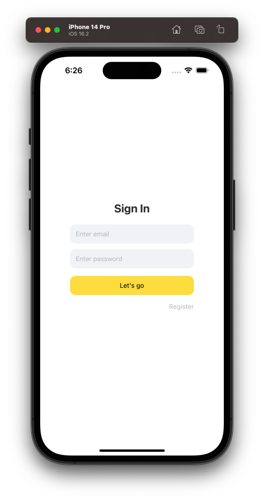
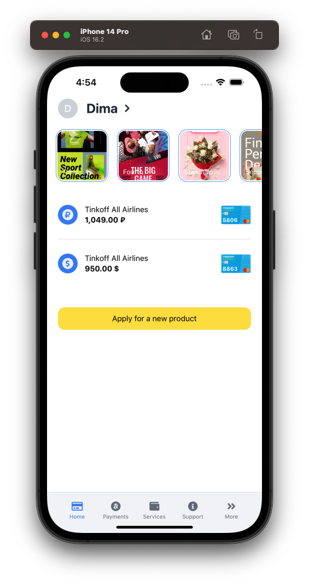
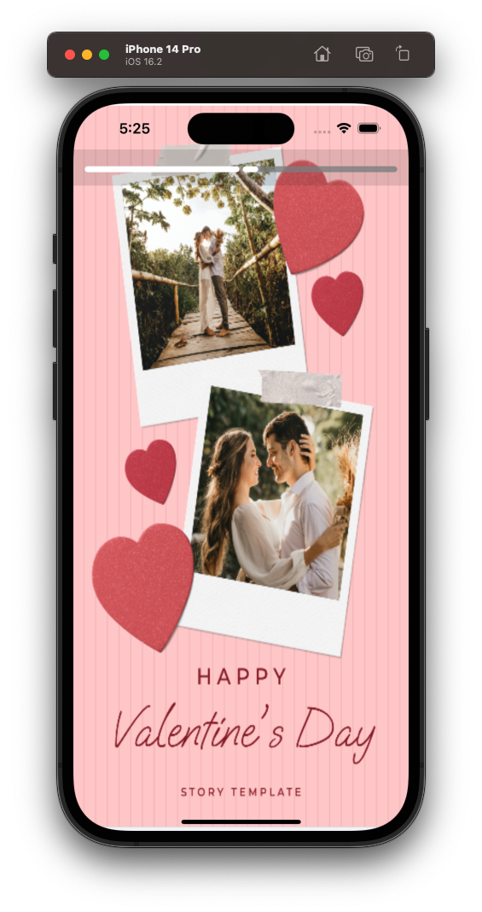
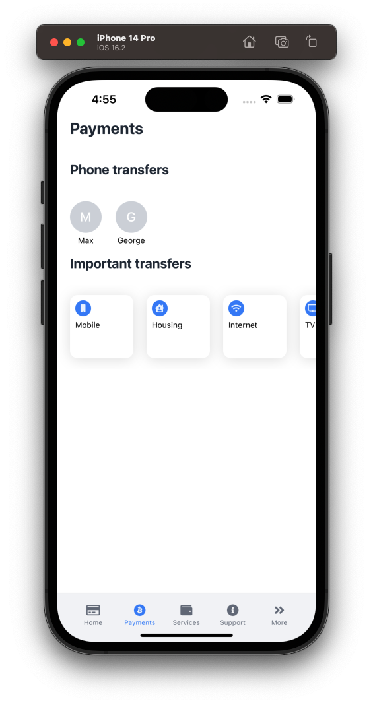
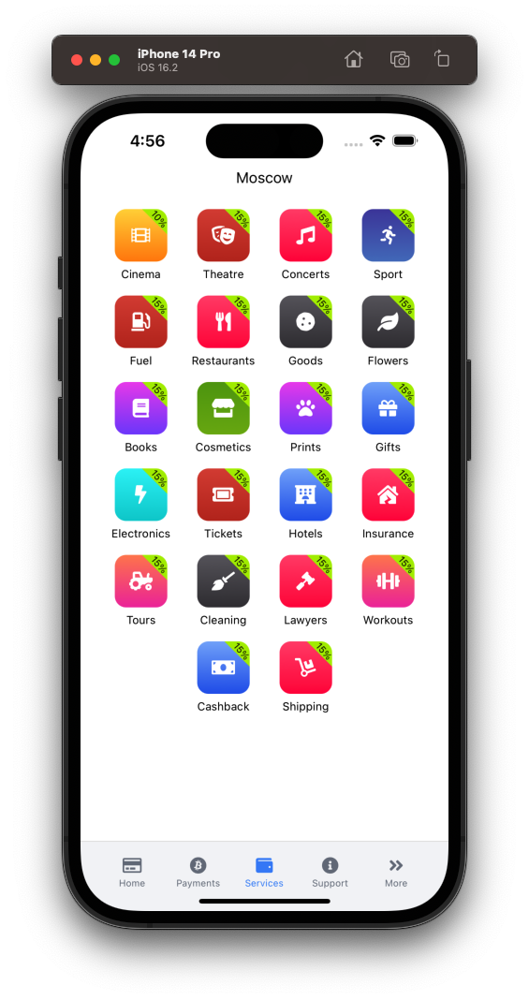
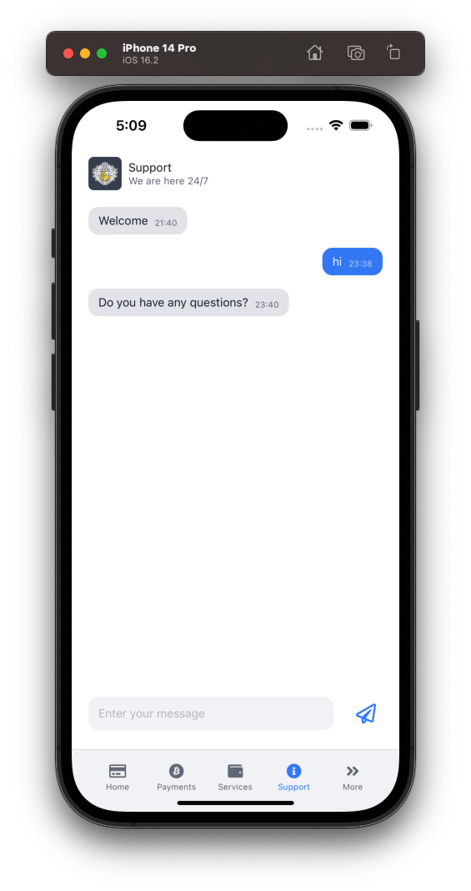
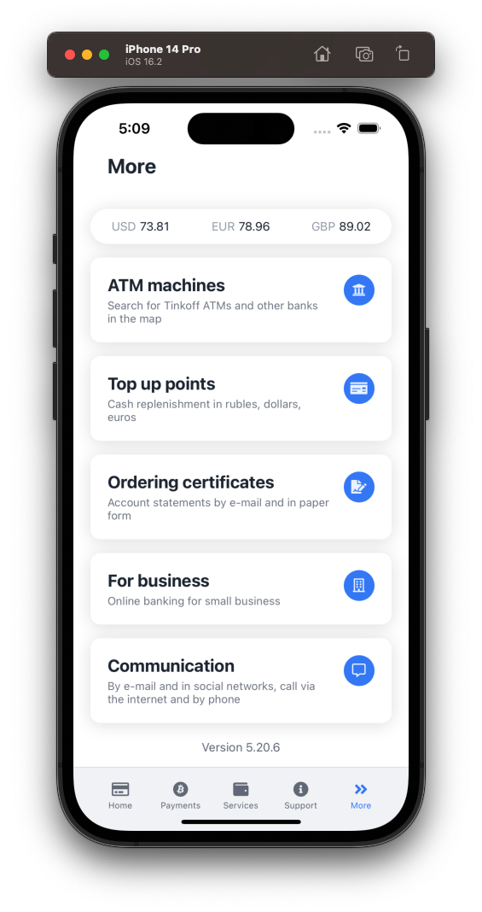

<!-- PROJECT SHIELDS -->
<!--
*** I'm using markdown "reference style" links for readability.
*** Reference links are enclosed in brackets [ ] instead of parentheses ( ).
*** See the bottom of this document for the declaration of the reference variables
*** for contributors-url, forks-url, etc. This is an optional, concise syntax you may use.
*** https://www.markdownguide.org/basic-syntax/#reference-style-links
-->
[![MIT License][license-shield]][license-url]
[![LinkedIn][linkedin-shield]][linkedin-url]


<!-- PROJECT LOGO -->
<br />
<div align="center">
  <a href="https://github.com/othneildrew/Best-README-Template">
    
  </a>

<h3 align="center">React Native Tinkoff Bank app clone</h3>

  <p align="center">
    Educational fullstack Tinkoff bank app clone project, working with Firebase. Builded on IOS and Android
  </p>
</div>

## 💻 Getting started

### Requirements

**Clone the project and access the folder**

```bash
$ git clone https://github.com/KOCMOHABTEP/TinkoffClone.git && cd TinkoffClone
```

**Follow the steps below**

```bash
# App working with firebase, firestore
# Prepare collections in firestore (accounts, contacts, messages, stories, users)

# Install the dependencies
$ yarn

# Add your freecurrencyapi.com API key in file 'app/consts.ts'

# If you are going to emulate with android, run this command
# Be sure to have the emulator open
$ yarn android

# If you are going to emulate with ios, run this command
$ yarn ios
```


<!-- ABOUT THE PROJECT -->
## About The Project

<div align="center">
    
    
    
    
    
    
</div>

### Built With

Frameworks and platform.

* [![React][React.js]][React-url]
* [![React-Native][React-Native.js]][React-Native-url]
* 
* 
* 
* 
* 

<p align="right">(<a href="#readme-top">back to top</a>)</p>

## Details
### Auth screen
<p>Simple firebase email/pass auth</p>
<div align="center">
    
</div>

### Home screen
<p>Edit profile, watch stories, add new bank product</p>
<div align="center">
    
</div>

### Payments screen
<p>Transfer money to different user or account</p>
<div align="center">
    
</div>

### Services screen
<p>List of different customizable services</p>
<div align="center">
    
</div>

### Support screen
<p>Chat with support, working with firestore</p>
<div align="center">
    
</div>

### More screen
<p>Get current currency with freecurrency.com API, different menu items with linking to Tinkoff bank</p>
<div align="center">
    
</div>


<!-- MARKDOWN LINKS & IMAGES -->
<!-- https://www.markdownguide.org/basic-syntax/#reference-style-links -->
[contributors-shield]: https://img.shields.io/github/contributors/othneildrew/Best-README-Template.svg?style=for-the-badge
[contributors-url]: https://github.com/othneildrew/Best-README-Template/graphs/contributors
[forks-shield]: https://img.shields.io/github/forks/othneildrew/Best-README-Template.svg?style=for-the-badge
[forks-url]: https://github.com/othneildrew/Best-README-Template/network/members
[stars-shield]: https://img.shields.io/github/stars/othneildrew/Best-README-Template.svg?style=for-the-badge
[stars-url]: https://github.com/othneildrew/Best-README-Template/stargazers
[issues-shield]: https://img.shields.io/github/issues/othneildrew/Best-README-Template.svg?style=for-the-badge
[issues-url]: https://github.com/othneildrew/Best-README-Template/issues
[license-shield]: https://img.shields.io/github/license/othneildrew/Best-README-Template.svg?style=for-the-badge
[license-url]: https://github.com/othneildrew/Best-README-Template/blob/master/LICENSE.txt
[linkedin-shield]: https://img.shields.io/badge/-LinkedIn-black.svg?style=for-the-badge&logo=linkedin&colorB=555
[linkedin-url]: https://www.linkedin.com/in/smirnovdm
[product-screenshot]: screenshots/screen-home.png
[Next.js]: https://img.shields.io/badge/next.js-000000?style=for-the-badge&logo=nextdotjs&logoColor=white
[Next-url]: https://nextjs.org/
[React.js]: https://img.shields.io/badge/React-20232A?style=for-the-badge&logo=react&logoColor=61DAFB
[React-url]: https://reactjs.org/
[React-Native.js]: https://img.shields.io/badge/react_native-%2320232a.svg?style=for-the-badge&logo=react&logoColor=%2361DAFB
[React-Native-url]:https://reactnative.dev/
